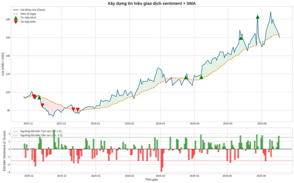
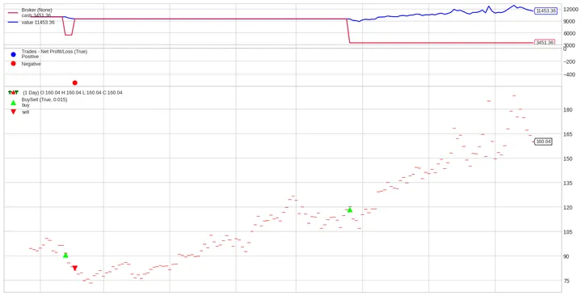
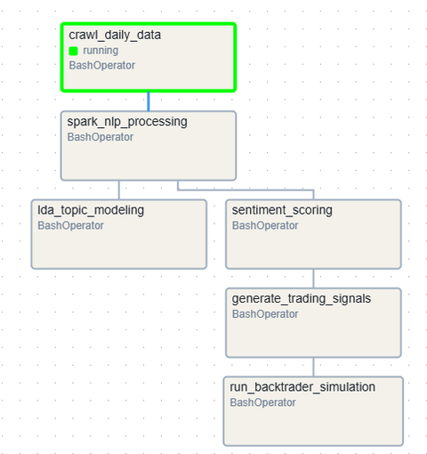

# 📊 Financial NLP Analytics Pipeline

> **Đồ án môn Khai phá Dữ liệu (Data Mining)** — Xây dựng hệ thống phân tích cảm xúc tin tức tài chính và tự động hóa tín hiệu giao dịch chứng khoán S&P 500 bằng NLP + Big Data.

---

## 🎯 Tổng quan Đồ án

Dự án xây dựng một **pipeline dữ liệu tự động hóa hoàn chỉnh** (end-to-end), từ khâu thu thập dữ liệu tin tức tài chính cho đến mô phỏng giao dịch (backtesting), sử dụng các công nghệ Big Data, NLP và tự động hóa qua Apache Airflow.

### Luồng xử lý chính

```
[Finnhub API / yFinance]
        │
        ▼
① CRAWL dữ liệu hàng ngày (Tin tức + Giá CP)
        │
        ▼
② TIỀN XỬ LÝ NLP (PySpark + spaCy + NLTK)
   - Làm sạch văn bản, loại stop-words
   - Tokenize & Lemmatize
        │
        ├──────────────────────────────┐
        ▼                              ▼
③ CHẤM ĐIỂM SENTIMENT          ④ MÔ HÌNH HÓA CHỦ ĐỀ (LDA)
   VADER vs. TextBlob              Tóm tắt 10 chủ đề chính
   So sánh 2 phương pháp           Trực quan pyLDAvis + WordCloud
        │
        ▼
⑤ TẠO TÍN HIỆU GIAO DỊCH
   (Z-Score Sentiment + SMA 20)
        │
        ▼
⑥ BACKTESTING
   (Backtrader Simulation)
```

---

## 🗂️ Cấu trúc Thư mục

```
Project-Financial-NLP_Analytics/
│
├── 📁 dags/
│   └── crypto_sentiment_pipeline.py   # Airflow DAG chính - định nghĩa toàn bộ pipeline
│
├── 📁 src/
│   ├── 📁 config/
│   │   └── setting.py                 # Cấu hình tập trung: MinIO, Spark, Ngưỡng Sentiment
│   │
│   ├── 📁 crawlers/
│   │   └── daily_finnhub_crawler.py   # Thu thập tin tức (Finnhub) + giá CP (yFinance)
│   │
│   ├── 📁 processing/
│   │   └── daily_spark_processor.py   # Tiền xử lý NLP: Tokenize & Lemmatize bằng spaCy
│   │
│   ├── 📁 models/
│   │   ├── sentiment_scoring_pipeline.py  # Chấm điểm VADER & TextBlob, lưu Iceberg
│   │   └── lda_topic_modeler.py           # Mô hình LDA phân tích chủ đề tin tức
│   │
│   ├── 📁 trading/
│   │   ├── signal_generator.py        # Tạo tín hiệu MUA/BÁN từ sentiment + giá
│   │   └── backtrader_strategy.py     # Mô phỏng backtesting với Backtrader
│   │
│   └── 📁 visualizer/
│       └── wordCloud_pyLDAvis.py      # Vẽ WordCloud và biểu đồ tương tác pyLDAvis
│
├── 📁 data/
│   └── View_Annual_Report_NLP_Tokens.txt  # Dữ liệu token từ báo cáo tài chính
│
├── 📁 work/                           # Notebooks Jupyter phân tích thủ công
├── 📁 docs/images/                    # Hình ảnh minh họa kết quả
│
├── Dockerfile                         # Image Docker cho môi trường Airflow + NLP
├── compose.yaml                       # Docker Compose: Airflow + MinIO + PostgreSQL + Jupyter
└── requirements.txt                   # Các thư viện Python cần cài đặt
```

---

## ⚙️ Công nghệ Sử dụng

| Lớp | Công nghệ | Mục đích |
|---|---|---|
| **Thu thập** | `finnhub-python`, `yfinance`, `requests` | Lấy tin tức và giá chứng khoán S&P 500 |
| **Lưu trữ** | **MinIO** (S3-compatible), **Apache Iceberg** | Data Lake phân tán, lịch sử phiên bản |
| **Xử lý** | **PySpark 3.5.1**, `spaCy` (`en_core_web_sm`) | Xử lý dữ liệu lớn song song, NLP |
| **NLP** | `NLTK`, `TextBlob`, `VADER` | Tokenize, Lemmatize, Chấm điểm cảm xúc |
| **Topic Model** | `PySpark MLlib LDA`, `pyLDAvis`, `wordcloud` | Phân tích chủ đề, trực quan hóa |
| **Trading** | `backtrader`, `matplotlib` | Tạo tín hiệu, mô phỏng giao dịch |
| **Tự động hóa** | **Apache Airflow** | Lập lịch chạy pipeline tự động mỗi ngày |
| **Hạ tầng** | **Docker**, **Docker Compose**, PostgreSQL | Container hóa toàn bộ hệ thống |

---

## 🔄 Chi tiết Các Bước Thực hiện

### 1. 🕷️ Thu thập Dữ liệu — `crawlers/daily_finnhub_crawler.py`

- Tự động lấy **danh sách ~500 mã cổ phiếu S&P 500** từ Wikipedia.
- Gọi **Finnhub API** để lấy tin tức tài chính mới nhất trong ngày cho từng mã.
- Gọi **yFinance** để lấy giá đóng cửa hàng ngày (Open, High, Low, Close, Volume).
- Lưu kết quả thô dưới định dạng **JSON** lên **MinIO** theo cấu trúc phân vùng ngày:
  ```
  s3://raw-financial-data/raw_zone_finnhub_daily/news_data_finnhub/YYYY/MM/DD/<ticker>.json
  s3://raw-financial-data/raw_zone_finnhub_daily/market_data/YYYY/MM/DD/<ticker>.json
  ```
- Có cơ chế xử lý rate-limit của Finnhub API (60 req/phút).

---

### 2. 🧹 Tiền xử lý NLP — `processing/daily_spark_processor.py`

Sử dụng **PySpark** để xử lý song song toàn bộ kho tin tức:

| Bước | Xử lý |
|---|---|
| Đọc JSON từ MinIO | `spark.read.format("json").load(...)` |
| Làm sạch văn bản | Chuyển thường, loại ký tự đặc biệt, chuẩn hóa khoảng trắng |
| **Tokenize** | Tách từng từ bằng `spaCy (en_core_web_sm)`, lọc stop-words |
| **Lemmatize** | Rút gọn từ về dạng gốc (lemma) bằng `spaCy` |
| Lưu kết quả | Ghi dạng **Apache Iceberg** vào `processed_zone.daily_news_nlp` |

> **Kết quả:** Mỗi bài báo có 4 cột: `title_tokens`, `title_lemmas`, `summary_tokens`, `summary_lemmas`

---

### 3. 🤖 Chấm điểm Sentiment — `models/sentiment_scoring_pipeline.py`

Đây là bước cốt lõi, thực hiện **so sánh song song 2 phương pháp phân tích cảm xúc**:

#### VADER (Valence Aware Dictionary and sEntiment Reasoner)
- Dựa trên từ điển được tối ưu cho văn bản tài chính, mạng xã hội.
- Trả về **Compound Score** trong khoảng `[-1.0, +1.0]`.
- Ngưỡng phân loại: `≥ 0.05` → Tích cực 🟢 | `≤ -0.05` → Tiêu cực 🔴

#### TextBlob
- Trả về **Polarity** `[-1, +1]` và **Subjectivity** `[0, 1]`.
- Ngưỡng phân loại: `≥ 0.1` → Tích cực | `≤ -0.1` → Tiêu cực.
- Thêm chiều **Khách quan / Chủ quan** (`Subjectivity ≥ 0.5`).

**Đầu ra:** Bảng `comprehensive_sentiment_scores` với 24 cột điểm số và nhãn, áp dụng trên cả `title` và `summary`, cả dạng `token` và `lemma`.

---

### 4. 🗂️ Mô hình LDA — `models/lda_topic_modeler.py`

Áp dụng **Latent Dirichlet Allocation (LDA)** từ PySpark MLlib để phát hiện cấu trúc chủ đề ẩn:

| Tham số | Giá trị |
|---|---|
| Số chủ đề (`k`) | 10 |
| Số vòng lặp | 20 |
| Từ khóa mỗi chủ đề | 5 |
| Kích thước từ điển | 10,000 |

**10 Chủ đề được phát hiện:**

| ID | Tên Chủ đề |
|---|---|
| 0 | Cổ phiếu Cổ tức & Tăng trưởng |
| 1 | Xu hướng AI & Vốn hóa Tỷ đô |
| 2 | So sánh Năng lực Cạnh tranh |
| 3 | Phân tích Biến động Giá Cổ phiếu |
| 4 | Chỉ số Vĩ mô & Hàng hóa |
| 5 | Khuyến nghị từ Chuyên gia |
| 6 | Đầu tư Năng lượng & Công nghệ Mới |
| 7 | Tin tức Sự kiện & Ra mắt trong ngày |
| 8 | Tác động của Yếu tố Chính trị - Vĩ mô |
| 9 | Mùa Báo cáo Tài chính Quý |

---

### 5. 📊 Trực quan hóa — `visualizer/wordCloud_pyLDAvis.py`

Hai loại trực quan hóa chính sau khi LDA chạy xong:

- **WordCloud**: Hiển thị tần suất từ khóa nổi bật theo từng chủ đề.
- **pyLDAvis**: Biểu đồ tương tác hiển thị khoảng cách giữa các chủ đề (inter-topic distance map), cho phép khám phá từ khóa đặc trưng của từng nhóm.

---

### 6. 📈 Tạo Tín hiệu Giao dịch — `trading/signal_generator.py`

Kết hợp **điểm VADER** với **chỉ số kỹ thuật** để tạo tín hiệu:

**Công thức tính Z-Score Sentiment:**
```
sentiment_z_score = (avg_vader_score - mean_20d) / std_20d
```

**Luật tạo tín hiệu (Z-Threshold = 1.5):**
```
Signal = +1 (MUA)  nếu Close > SMA_20  VÀ  Z-Score > +1.5
Signal = -1 (BÁN)  nếu Close < SMA_20  VÀ  Z-Score < -1.5
Signal =  0 (GIỮ)  trong các trường hợp còn lại
```

**Biểu đồ tín hiệu giao dịch:**



---

### 7. 🏦 Backtesting — `trading/backtrader_strategy.py`

Mô phỏng giao dịch thực tế bằng **Backtrader**:

- Vốn ban đầu: **10,000 USD**
- Áp dụng tín hiệu MUA/BÁN từ bước trên vào lịch sử giá thực tế.
- Tính toán **Net Profit/Loss**, **Portfolio Value** theo thời gian.
- Hiển thị điểm MUA (▲ xanh) / BÁN (▼ đỏ) trực tiếp trên biểu đồ giá.

**Kết quả mô phỏng backtesting:**



---

## 🤖 Tự động hóa với Apache Airflow

### DAG: `crypto_sentiment_trading_pipeline`

Pipeline được lập lịch **chạy tự động lúc 17:00 hàng ngày** (cron: `0 17 * * *`).

**Sơ đồ luồng DAG:**



| Task | Mô tả |
|---|---|
| `crawl_daily_data` | Thu thập tin tức Finnhub + giá yFinance |
| `spark_nlp_processing` | Tokenize & Lemmatize bằng PySpark + spaCy |
| `sentiment_scoring` | Chấm điểm VADER & TextBlob |
| `lda_topic_modeling` | Phân tích chủ đề LDA *(chạy song song với sentiment)* |
| `generate_trading_signals` | Tính Z-Score và tạo tín hiệu MUA/BÁN |
| `run_backtrader_simulation` | Mô phỏng giao dịch và vẽ báo cáo |

**Thứ tự phụ thuộc:**
```
crawl_daily_data
    └── spark_nlp_processing
            ├── lda_topic_modeling        (nhánh song song)
            └── sentiment_scoring
                    └── generate_trading_signals
                                └── run_backtrader_simulation
```

---

## 🚀 Hướng dẫn Cài đặt & Chạy

### Yêu cầu

- Docker Desktop >= 24.x
- Docker Compose >= 2.x
- RAM tối thiểu: **8 GB** (khuyến nghị 16 GB)

### Bước 1: Clone và cấu hình

```bash
git clone <repo-url>
cd Project-Financial-NLP_Analytics
```

### Bước 2: Khởi động toàn bộ hệ thống

```bash
docker compose up -d
```

Lệnh này sẽ khởi động:
| Service | URL | Mô tả |
|---|---|---|
| **Airflow Webserver** | http://localhost:8080 | Giao diện quản lý pipeline (admin/admin) |
| **MinIO Console** | http://localhost:9001 | Giao diện quản lý Data Lake |
| **Jupyter Notebook** | http://localhost:8888 | Môi trường phân tích thủ công |
| **Spark UI** | http://localhost:4040 | Theo dõi Spark jobs |

### Bước 3: Kích hoạt DAG trên Airflow

1. Truy cập http://localhost:8080 (admin / admin)
2. Bật DAG `crypto_sentiment_trading_pipeline`
3. Pipeline sẽ tự chạy vào 17:00 mỗi ngày, hoặc bấm **Trigger DAG** để chạy thủ công

### Bước 4: Chạy Pipeline thủ công (không qua Airflow)

```bash
# Bước 1: Crawl dữ liệu
docker exec airflow-webserver python /opt/airflow/src/crawlers/daily_finnhub_crawler.py 2026-06-25

# Bước 2: Xử lý NLP
docker exec airflow-webserver python /opt/airflow/src/processing/daily_spark_processor.py 2026-06-25

# Bước 3: Chấm điểm Sentiment
docker exec airflow-webserver python /opt/airflow/src/models/sentiment_scoring_pipeline.py 2026-06-25

# Bước 4: LDA (song song)
docker exec airflow-webserver python /opt/airflow/src/models/lda_topic_modeler.py 2026-06-25

# Bước 5: Tạo tín hiệu
docker exec airflow-webserver python /opt/airflow/src/trading/signal_generator.py 2026-06-25

# Bước 6: Backtesting
docker exec airflow-webserver python /opt/airflow/src/trading/backtrader_strategy.py 2026-06-25
```

---

## 📦 Cài đặt Thư viện

```bash
pip install -r requirements.txt
python -m spacy download en_core_web_sm
python -c "import nltk; nltk.download('vader_lexicon')"
```

**`requirements.txt`**:
```
pyspark==3.5.1
textblob
nltk
vaderSentiment
yfinance
finnhub-python
boto3
pandas
backtrader
matplotlib
spacy
```

---

## 🗃️ Kiến trúc Dữ liệu (Data Lake)

```
MinIO Bucket: raw-financial-data/
│
├── 📁 raw_zone_finnhub_daily/
│   ├── 📁 news_data_finnhub/
│   │   └── YYYY/MM/DD/<TICKER>.json       # Tin tức thô từ Finnhub
│   └── 📁 market_data/
│       └── YYYY/MM/DD/<TICKER>.json       # Giá OHLCV từ yFinance
│
└── 📁 iceberg_warehouse_daily/            # Apache Iceberg Tables
    └── processed_zone/
        ├── daily_news_nlp                 # Tin tức sau NLP (token + lemma)
        ├── daily_market_prices            # Giá cổ phiếu đã làm sạch
        ├── comprehensive_sentiment_scores # Điểm VADER & TextBlob
        ├── news_lda_summarized            # Phân loại chủ đề LDA
        └── trading_signals               # Tín hiệu MUA/BÁN + Z-Score
```

---

## 📐 Cấu hình Hệ thống

Tất cả cấu hình tập trung tại [`src/config/setting.py`](src/config/setting.py):

```python
class Settings:
    MINIO_URL         = "http://minio:9000"
    MINIO_ACCESS_KEY  = "dataNLPmining-lab"
    BUCKET_NAME       = "raw-financial-data"

    # Ngưỡng Sentiment
    TB_POS  = 0.1    # TextBlob Positive threshold
    TB_NEG  = -0.1   # TextBlob Negative threshold
    VD_POS  = 0.05   # VADER Positive threshold
    VD_NEG  = -0.05  # VADER Negative threshold
    TB_SUB  = 0.5    # Subjectivity threshold
```

---

## 👥 Thông tin Nhóm

> **Nhóm 5 — Đồ án Data Mining**
> Owner DAG: `nhom_5_do_an_7`

---

## 📄 License

Dự án được thực hiện cho mục đích **học thuật**. Không sử dụng cho mục đích thương mại.
